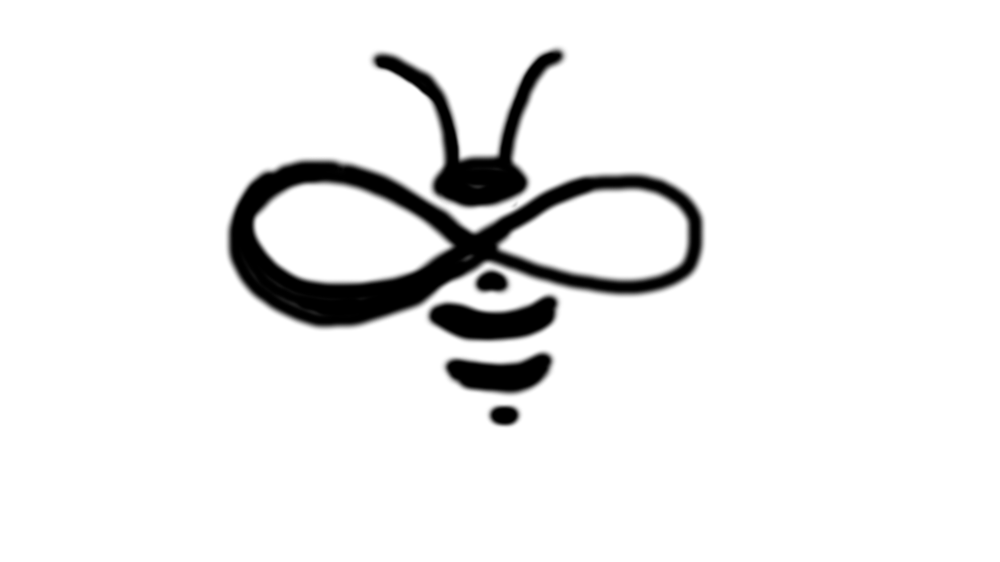
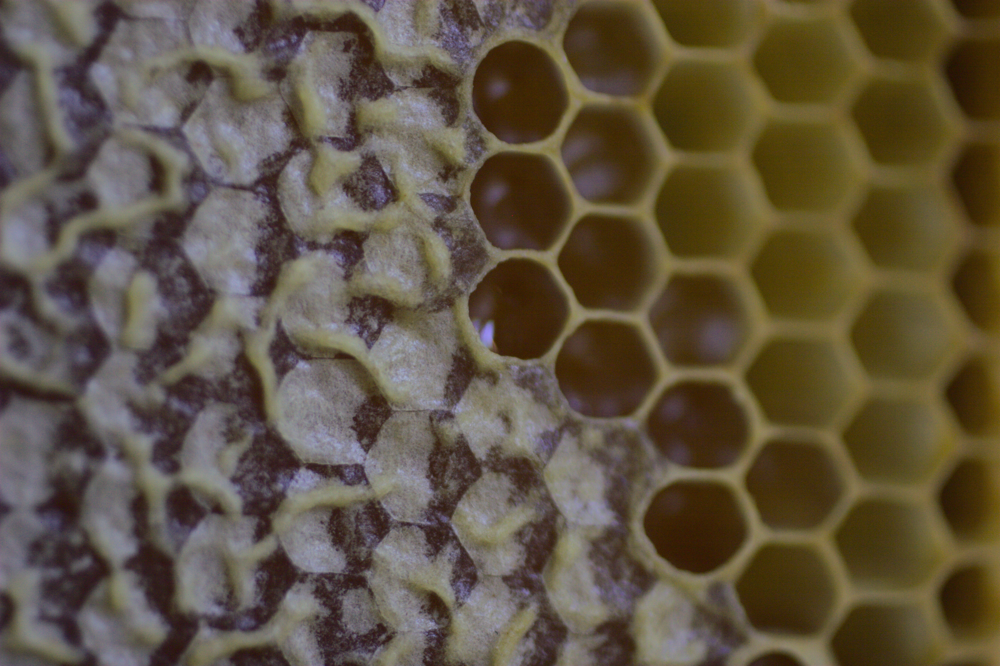
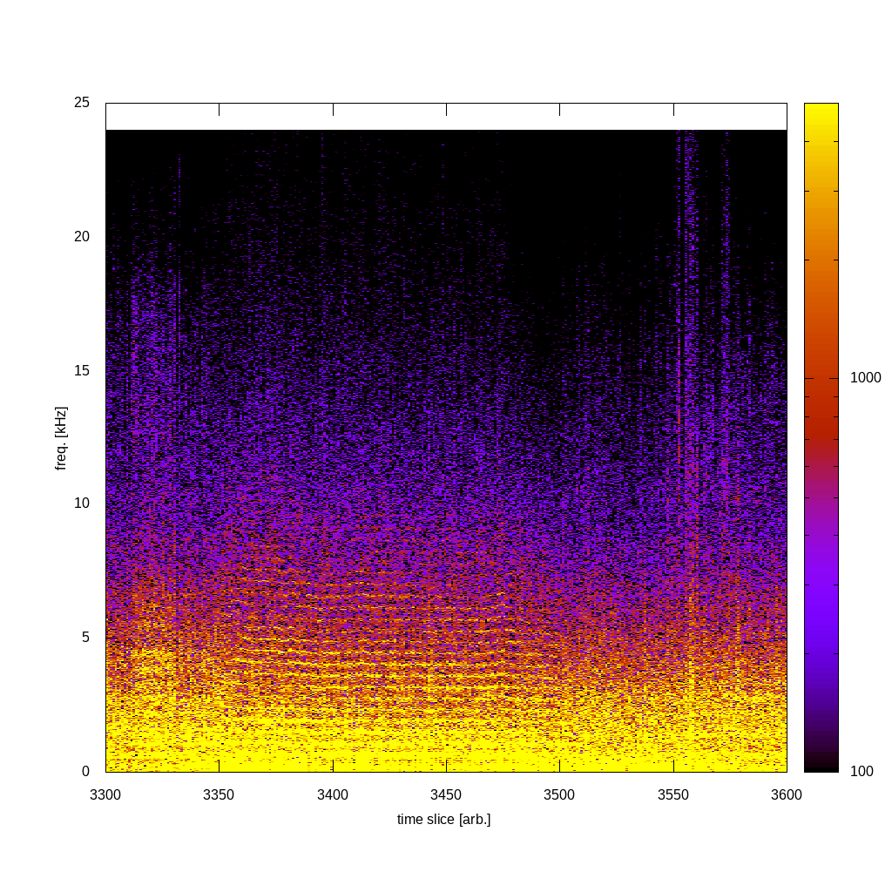
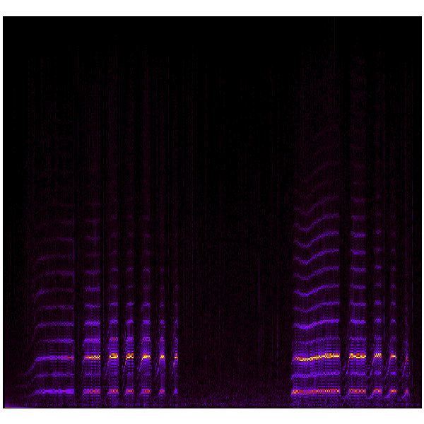
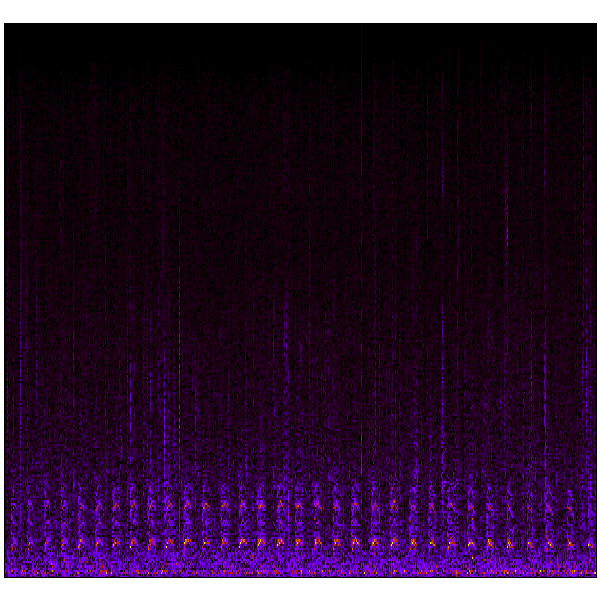

# APIary/Bee project repository.  
Repository for Documents and code pertaining to the Bee Environmental Project.



Image courtesy Grace Coffee

The goal of the Gov/REN team is to coordinate engagement with the Federal Government and Educational Institutions.

# Gov/REN Team Members
Dennis O'Connel - APIary co-lead - Yahoo! - denniscoconnell@gmail.com
Erik Erlandson - APIary co-lead - Red Hat - eerlands@redhat.com
Ryan Coffee - Stanford/SLAC
Leo Hoarty - Sweet Vinyl
Bill Wright - Red Hat

For questions, or to be added (or removed) from the team, please contact either Dennis or Erik.  

# Meetings  

Meetings are bi-weekly on Thursdays at noon.

# Spectrograms


Quick spectrogram from Ryan Hive 2, Leo prototype microphone-0.  Seems the *information* dies out in the vicinity of 10 kHz.  Our ultrasonic hypothesis is very likely overkill.


Tooting


Quacking


Connect with Don DuRouseau (drdurous@uak.edu) regarding inducing a calm state in bees using the piezos as speakers in the hive.
Don was at GPN22 talking to me about brain waves and phase coherences.
Connect "the Dons"--DuRouseau and ALvarez--on the hive control.  

# links of interest

```https://community.hiveeyes.org/t/queen-piping-visualization-and-analysis/461```

```doi: 10.1126/science.abj8369```

```https://www.ars.usda.gov/northeast-area/beltsville-md-barc/beltsville-agricultural-research-center/bee-research-laboratory/```

```https://conferenceindex.org/conferences/apiculture```

```https://app.birdweather.com/```
